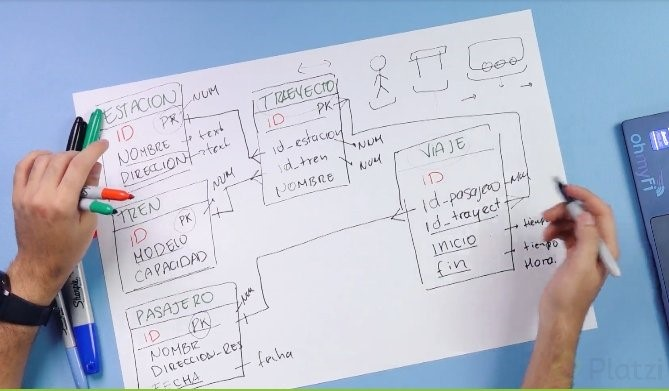

# Curso-de-PostgreSQL x Platzi 💚
- [Curso de PostgreSQL](#curso-de-postgresql)
  - [Modulo 1 Configurar Postgres](#modulo-1-configurar-postgres)
    - [Clase 1 Introduccion](#clase-1-introduccion)
    - [Clase 2 Que es Postgresql](#clase-2-que-es-postgresql)
    - [Clase 3 Instalacion y configuración de la Base de Datos](#clase-3-instalacion-y-configuración-de-la-base-de-datos)
    - [Clase 4 Interacción con Postgres desde la Consola](#clase-4-interacción-con-postgres-desde-la-consola)
      - [Comandos importantes PostgreSQL](#comandos-importantes-postgresql)
    - [Clase 5 PgAdmin: Interaccion con Postgres desde la Interfaz Grafica](#clase-5-pgadmin-interaccion-con-postgres-desde-la-interfaz-grafica)
    - [Clase 6 Archivos de Configuracion](#clase-6-archivos-de-configuracion)
    - [Clase 7 Comandos mas utilizados en PostgreSQL](#clase-7-comandos-mas-utilizados-en-postgresql)
      - [Comandos de ayuda](#comandos-de-ayuda)
      - [Comandos de navegacion y consulta de informacion](#comandos-de-navegacion-y-consulta-de-informacion)
      - [Comandos de inspeccion y ejecucion](#comandos-de-inspeccion-y-ejecucion)
      - [Comandos para debug y optimizacion](#comandos-para-debug-y-optimizacion)
      - [Comandos para cerrar la consola](#comandos-para-cerrar-la-consola)
      - [Ejecutando consultas en la base de datos usando la consola](#ejecutando-consultas-en-la-base-de-datos-usando-la-consola)
  - [Clase 8 Presentación del Proyecto](#clase-8-presentación-del-proyecto)
  - [Clase 9 Tipos de Datos](#clase-9-tipos-de-datos)
  - [Clase 10 Diseñando nuestra base de datos: estructura de las tablas](#clase-10-diseñando-nuestra-base-de-datos-estructura-de-las-tablas)
  - [Clase 11 Jerarquia de Bases de Datos](#clase-11-jerarquia-de-bases-de-datos)
  - [Modulo 2 Gestión de la información en bases de datos](#modulo-2-gestión-de-la-información-en-bases-de-datos)
    - [Clase 12 Creación de Tablas](#clase-12-creación-de-tablas)
    - [clase 13 Particiones](#clase-13-particiones)
    - [Clase 14 Creacion de Roles](#clase-14-creacion-de-roles)
      - [Creando roles desde SQL Shell](#creando-roles-desde-sql-shell)
      - [Creando roles desde PGAdmin](#creando-roles-desde-pgadmin)
## Modulo 1 Configurar Postgres

### Clase 1 Introduccion

Introduccion por el profesor

### Clase 2 Que es Postgresql

Postgre es un motor de base de datos open source y usa el Objeto-Relacional, existen tres conceptos importantes acerca de las bases de datos

- lenguaje
- motor: Permite estructurar toda la información dentro de un servidor
- servidor

Esta base de datos cumple con el estándar ACID (reglas para bases de datos para tener buenas practicas)

**• A: Atomicity – Atomicidad** -> Separar las funciones desarrolladas en la BD como pequeñas tareas y ejecutarlas como un todo. Si alguna tarea falla se hace un rollback(Se deshacen los cambios)

**• C: Consistency – Consistencia** -> Todo lo que se desarrolló en base al objeto relacional. Los datos tienen congruencia (gracias a PK y FK)

**• I: Isolation – Aislamiento** -> Varias tareas ejecutándose al mismo tiempo dentro de la BD (o varias instancias)

**• D: Durability – Durabilidad** -> Puedes tener seguridad que la información no se perderá por un fallo catastrófico. PostgreSQL guarda la información en una Bitácora y luego guarda el cambio efectivo en la base de datos.

Por Que PostgreSQL

- Tipos de Datos
- Integridad de Datos
- Concurrencia, Rendimiento
- Fiabilidad, recuperación ante desastres
- Seguridad
- Extensibilidad
- Internacionalizacion
- Búsqueda de Texto
- Funciones com PostGIS y PL

### Clase 3 Instalacion y configuración de la Base de Datos

Vamos a instalar PostgreSQL en nuestra computadora. A continuación veremos el paso a paso y algunos consejos útiles para instalar y configurar correctamente PostgreSQL en nuestro equipo. En éste caso, usaremos Windows, pero los pasos son bastante similares entre los diferentes sistemas operativos.

Primer paso: ir a <https://www.postgresql.org/> y descargar la version acorde a tu sistema operativo, una vez dentro de esa seccion haz click en **download installer**.

Es altamente recomendable seleccionar la penúltima o antepenúltima versión. Si bien la última versión estable está disponible, en éste caso la 2.0, no es recomendable instalarla en nuestro equipo, ya que al momento de instalarla o usar un servicio en la Nube para Postgres, lo más seguro es que no esté disponible y sólo esté hasta la versión.5, que no es la última versión. Esto porque todos los proveedores de Infraestructura no disponen de la versión de Postgres más actual siempre (tardan un poco en apropiar los nuevos lanzamientos).

Si tienes un equipo con Linux, la instalación la puedes hacer directamente desde los repositorios de Linux, EDB ya no ofrece soporte para instaladores en Linux debido a que se ha vuelto innecesario, el repositorio de Linux con PostgreSQL ofrece una manera mucho más sencilla y estándar para instalar PostgreSQL en linux.

Segundo paso: descargamos la versión “Windows x86-64” (porque nuestro sistema operativo es de 64 bits). En caso de que tu equipo sea de 32 bits debes seleccionar la opción “Windows x86-32”.

Vamos a descargar la versión.5. Hacemos clic en Download y guardamos el archivo que tendrá un nombre similar a:
“postgresql-.5-2-windows-x64.exe”

Ahora vamos a la carpeta donde descargamos el archivo .exe, debe ser de aproximadamente 90 MB, lo ejecutamos.


Hacemos clic en siguiente. Si deseas cambiar la carpeta de destino, ahora es el momento:


Seleccionamos los servicios que queremos instalar. En este caso dejamos seleccionados todos menos “Stack Builder”, pues ofrece la instalación de servicios adicionales que no necesitamos hasta ahora. Luego hacemos clic en siguiente:


Ahora indicamos la carpeta donde iran guardados los datos de la base de datos, es diferente a la ruta de instalación del Motor de PostgreSQL, pero normalmente será una carpeta de nuestra carpeta de instalación. Puedes cambiar la ruta si quieres tener los datos en otra carpeta. Hacemos clic en siguiente.


Ingresamos la contraseña del usuario administrador. De manera predeterminada, Postgres crea un usuario super administrador llamado **postgres** que tiene todos los permisos y acceso a toda la base de datos, tanto para consultarla como para modificarla. En éste paso indicamos la clave de ese usuario super administrador.

Debes ingresar una clave muy segura y guardarla porque la vas a necesitar después. Luego hacemos clic en siguiente.


Ahora si queremos cambiar el puerto por donde el servicio de Postgresql estará escuchando peticiones, podemos hacerlo en la siguiente pantalla, si queremos dejar el predeterminado simplemente hacemos clic en siguiente.


La configuración regional puede ser la predeterminada, no es necesario cambiarla, incluso si vamos a usarla en español, ya que las tildes y las eñes estarán soportadas si dejas la configuración regional predeterminada. Es útil cambiarla cuando quieras dejar de soportar otras funciones de idiomas y lenguajes diferentes a uno específico. Luego hacemos clic en siguiente:


En pantalla aparecerá el resumen de lo que se va a instalar:


Al hacer clic en siguiente se muestra una pantalla que indica que PostgreSQL está listo para instalar, al hacer clic de nuevo en siguiente iniciará la instalación, espera un par de minutos hasta que la aplicación termine.

Una vez terminada la instalación, aparecerá en pantalla un mensaje mostrando que PostgreSQL ha sido instalado correctamente.


Podemos cerrar ésta pantalla y proceder a comprobar que todo quedó instalado correctamente.

Vamos a buscar el programa PgAdmin, el cual usaremos como editor favorito para ejecutar en él todas las operaciones sobre nuestra base de datos.

También vamos a buscar la consola… Tanto la consola como PgAdmin son útiles para gestionar nuestra base de datos, una nos permite ingresar comando por comandos y la otra nos ofrece una interfaz visual fácil de entender para realizar todas las operaciones.

En el menú de Windows (o donde aparecen instalados todos los programas) buscamos “PgAdmin…”


Ahora buscamos “SQL Shell…”


Efectivamente, ahora aparecen las herramientas que vamos a utilizar en éste curso.
Ahora vamos a crear una base de datos de prueba usando la consola y comprobaremos si existe usando PgAdmin, la crearemos para validar que la conexión con el servicio de base de datos interno funciona correctamente.

Para ello abrimos la consola, buscamos SQL Shell y lo ejecutamos. Veremos algo así:


Lo que vemos en pantalla es la consola esperando que ingresemos cada parámetro para la conexión.

Primero está el nombre del parámetro. En éste caso es “Server” seguido de unos corchetes que contienen el valor predeterminado. Si presionamos “Enter” sin digitar nada la consola asumirá que te refieres al valor predeterminado, si en éste caso presionamos “Enter” el valor asumido será “Localhost”. Localhost se refiere a nuestra propia máquina, si instalaste la base de datos en el mismo pc que estás usando para la consola, el valor correcto es Localhost o 27.0.0. (representan lo mismo).

Podemos dejar todos los valores predeterminados (presionando “Enter”) hasta que la consola pregunte por la clave del usuario maestro:


Debemos ingresar la clave que usamos cuando estábamos instalando Postgres, de lo contrario no podremos acceder. Presionamos Enter y veremos a continuación una pantalla que nos indica que estamos logueados en la base de datos y estamos listos para hacer modificaciones.

De manera predeterminada, la base de datos instalada es Postgres, la cual no debemos tocar, ya que ejecuta funciones propias del motor. Es usada por el Motor de PostgreSQL para interactuar con todas las bases de datos que vayamos a crear en el futuro.

La siguiente imagen indica que estamos conectados a la base de datos Postgres. Vamos a crear una base de datos nueva y luego saltar el cursor a ésta base de datos recién creada.


Para ello escribimos el comando “**CREATE DATABASE transporte_publico;**” y presionamos “Enter”. Veremos:


El mensaje **“CREATE DATABASE”** justo después de la línea que acabamos de escribir indica que la base de datos fue creada correctamente.

Para saltar a la base de datos recién creada ejecutamos el comando “**\c transporte_publico**”, el cursor mostrará lo siguiente:


Ahora vamos a validar desde PgAdmin que la base de datos fué creada correctamente. Abrimos PgAdmin y nos encontramos con una lista de items a la izquierda, lo que significa que de manera predeterminada PgAdmin ha creado un acceso a nuestra base de datos local, el cual llamó “PostgreSQL”:


Al hacer hacer doble clic sobre éste elemento (“PostgreSQL”) nos pedirá ingresar la clave que hemos determinado para el super usuario postgres, al igual que la consola, hasta no ingresarla correctamente no nos podremos conectar:


Ingresamos la clave. Te recomiendo seleccionar la opción “Save Password” o “Guardar Contraseña”. Si la máquina sobre la que estás trabajando es de confianza, que seas sólo tú o tu equipo quien tenga acceso a ella, de lo contrario, no guardes la contraseña para mantenerla segura.

Veremos la lista de bases de datos disponibles, la predeterminada “postgres” y la que acabamos de crear usando la consola, lo que comprueba que la base de datos y la consola funcionan correctamente.


Ahora procedemos a eliminar la base de datos recién creada para comprobar que PgAdmin está correctamente configurada y si pueda realizar cambios sobre la base de datos.

Para ello hacemos clic derecho sobre el elemento “transporte_publico” y seleccionamos la opción “Delete/Drop”. Al mensaje de confirmar hacemos clic en OK.

Con ello, si el elemento “transporte_publico” desaparece del menú de la izquierda comprobamos que PgAdmin funcionan correctamente.

### Clase 4 Interacción con Postgres desde la Consola

Vamos a aprender los comandos mas útiles en la shell, al iniciar siempre encontramos los siguientes puntos

Server [localhost]: valor predeterminado o del server al que queremos conectarnos

Database [postgres]: Escribe aquí la base de datos a la que quieres ingresar o enter para la predeterminada

Port [5432]: Idem conceptos anteriores

Username [postgres]: Idem conceptos anteriores

Contraseña para usuario postgres:

#### Comandos importantes PostgreSQL

- **\l**: lista las bases de datos del sistema (siempre va a haber por default 3 bases de datos propias de postgre + las que agreguemos).

- **\dt**" muestra las tablas de la base de datos de postgresql

- **\c + nombre base de datos**: usar una base de datos

- **\d + nombre tabla consultar**: describe el contenido de una tabla especifica.

- **\h SELECT**: ayuda para funciones estándar SQL.

- **SELECT version();**: ver la version de PostgreSQL

- **\g** permite volver a ejecutar la funcion previa ejecutada en consola (repetir lo anterior).

- **\timing**: muestra el tiempo de ejecución de un comando, algo muy importante para las optimizaciones.

### Clase 5 PgAdmin: Interaccion con Postgres desde la Interfaz Grafica

Esta clase retoma los comandos anteriores del shell ahora con la interfaz grafica.

Para conectarnos tenemos el item PostgreSQL(   ), a diferencia de la shell PGAdmin permite hacer cosas custom como colores y tags.

Creamos una base de datos propia usando la parte de server del arbol del admin.

En el dashboard podemos observar como Postgres usa el mismo motor de forma redundante para hacerse consultas a si mismo y saber que esta pasando en el entorno de ejecución para esta base de datos.

En la parte del Admin en Server podemos crear una base de datos  desde cero a partir del servidor y conectarla al localhost o a una base de datos alojada en un server local o remoto.


Podemos usar en el menu de  tools el Query tools


### Clase 6 Archivos de Configuracion

Antes de crear tablas o hacer diseños es importante conocer 3 archivos de configuracion que muchas veces son el origen de los problemas cuando estamos agregando nuevos servicios o configurando la base de datos

Los archivos de configuración son tres principales:

- **postgreql.conf**: en este archivo podemos cambiar puerto, numero de conexiones maxima, accesos para ip únicas. (un pro en bases de datos siempre ha leído todo el documento). En este archivo también se encuentra la información de las replicas

- **pg.hba.conf**: contiene los roles, tipos de usuarios, permisos, direcciones, métodos de acceso con MD5, también puedo negar a otros hosts a conectarnos,este archivo es muy importante dado que nos permite no solo dar acceso a usuarios y a las replicas sino protegernos de ataques o personas mal intencionados

- **pg_ident.conf**

La ruta de los mismos depende del sistema Operativo, para saber que que ruta están, basta con hacer una Query

**SHOW config_file**;

NOTA: siempre es bueno hacer una copia original de los archivos antes de modificarlos por si movemos algo que no.

### Clase 7 Comandos mas utilizados en PostgreSQL

La consola en PostgreSQL es una herramienta muy potente para crear, administrar y depurar nuestra base de datos. podemos acceder a ella después de instalar PostgreSQL y haber seleccionado la opción de instalar la consola junto a la base de datos.

PostgreSQL está más estrechamente acoplado al entorno UNIX que algunos otros sistemas de bases de datos, utiliza las cuentas de usuario nativas para determinar quién se conecta a ella (de forma predeterminada). El programa que se ejecuta en la consola y que permite ejecutar consultas y comandos se llama psql, psql es la terminal interactiva para trabajar con PostgreSQL, es la interfaz de línea de comando o consola principal, así como PgAdmin es la interfaz gráfica de usuario principal de PostgreSQL.

Después de emitir un comando PostgreSQL, recibirás comentarios del servidor indicándote el resultado de un comando o mostrándote los resultados de una solicitud de información. Por ejemplo, si deseas saber qué versión de PostgreSQL estás usando actualmente, puedes hacer lo siguiente:

```sql
SELECT version()
```

#### Comandos de ayuda

En consola los dos principales comandos con los que podemos revisar el todos los comandos y consultas son:

**\?** Con el cual podemos ver la lista de todos los comandos disponibles en consola, comandos que empiezan con backslash()


**\h** Con este comando veremos la información de todas las consultas SQL disponibles en consola. Sirve también para buscar ayuda sobre una consulta específica, para buscar información sobre una consulta específica basta con escribir \h seguido del inicio de la consulta de la que se requiera ayuda, así: \h ALTER

De esta forma podemos ver toda la ayuda con respecto a la consulta ALTER


#### Comandos de navegacion y consulta de informacion

**\c** Saltar entre bases de datos

**\l** Listar base de datos disponibles

**\dt** Listar las tablas de la base de datos

**\d <nombre_tabla>** Describir una tabla

**\dn** Listar los esquemas de la base de datos actual

**\df** Listar las funciones disponibles de la base de datos actual

**\dv** Listar las vistas de la base de datos actual

**\du** Listar los usuarios y sus roles de la base de datos actual

#### Comandos de inspeccion y ejecucion

**\g** Volver a ejecutar el comando ejecutando justo antes

**\s** Ver el historial de comandos ejecutados

**\s <nombre_archivo>** Si se quiere guardar la lista de comandos ejecutados en un archivo de texto plano

**\i <nombre_archivo>** Ejecutar los comandos desde un archivo

**\e** Permite abrir un editor de texto plano, escribir comandos y ejecutar en lote. \e abre el editor de texto, escribir allí todos los comandos, luego guardar los cambios y cerrar, al cerrar se ejecutarán todos los comandos guardados.

**\ef** Equivalente al comando anterior pero permite editar también funciones en PostgreSQL\

#### Comandos para debug y optimizacion

**\timing** Activar / Desactivar el contador de tiempo por consulta

#### Comandos para cerrar la consola

**\q** Cerrar la consola

#### Ejecutando consultas en la base de datos usando la consola

De manera predeterminada PostgreSQL no crea bases de datos para usar, debemos crear nuestra base de datos para empezar a trabajar, verás que existe ya una base de datos llamada **postgres** pero no debe ser usada ya que hace parte del CORE de PostgreSQL y sirve para gestionar las demás bases de datos.

Para crear una base de datos debes ejecutar la consulta de creación de base de datos, es importante entender que existe una costumbre no oficial al momento de escribir consultas; consiste en poner en mayúsculas todas las palabras propias del lenguaje SQL cómo **CREATE**, **SELECT**, **ALTER**, etc y el resto de palabras como los nombres de las tablas, columnas, nombres de usuarios, etc en minúscula. No está claro el porqué de esta especie de “estándar” al escribir consultas SQL pero todo apunta a que en el momento que SQL nace, no existían editores de consultas que resaltaran las palabras propias del lenguaje para diferenciar fácilmente de las palabras que no son parte del lenguaje, por eso el uso de mayúsculas y minúsculas.

Las palabras reservadas de consultas SQL usualmente se escriben en mayúscula, ésto para distinguir entre nombres de objetos y lenguaje SQL propio, no es obligatorio, pero podría serte útil en la creación de Scripts SQL largos.

Vamos ahora por un ligero ejemplo desde la creación de una base de datos, la creación de una tabla, la inserción, borrado, consulta y alteración de datos de la tabla.

Primero crea la base de datos, **“CREATE DATABASE transporte;”** sería el primer paso.


Ahora saltar de la base de datos **postgres** que ha sido seleccionada de manera predeterminada a la base de datos transporte recién creada utilizando el comando \c transporte.


Ahora vamos a crear la tabla tren, el SQL correspondiente sería:

```sql
CREATE TABLE tren ( id serial NOT NULL, modelo character varying, capacidad integer, CONSTRAINT tren_pkey PRIMARY KEY (id) );
```

La columna id será un número autoincremental (cada vez que se inserta un registro se aumenta en uno), modelo se refiere a una referencia al tren, capacidad sería la cantidad de pasajeros que puede transportar y al final agregamos la llave primaria que será id.


Ahora que la tabla ha sido creada, podemos ver su definición utilizando el comando `\d tren`


PostgreSQL ha creado el campo id automáticamente cómo integer con una asociación predeterminada a una secuencia llamada ‘tren_id_seq’. De manera que cada vez que se inserte un valor, id tomará el siguiente valor de la secuencia, vamos a ver la definición de la secuencia. Para ello, \d `tren_id_seq` es suficiente:


Vemos que la secuencia inicia en uno, así que nuestra primera inserción de datos dejará a la
columna id con valor uno.

```sql
INSERT INTO tren( modelo, capacidad ) VALUES (‘Volvo ’, 00);
```


```sql
SELECT * FROM tren;
```

Consultamos ahora los datos en la tabla:


Vamos a modificar el valor, establecer el tren con id uno que sea modelo Honda 0726. Para ello ejecutamos la consulta tipo **UPDATE tren SET modelo = 'Honda 0726' Where id = 1**;


Verificamos la modificación **SELECT * FROM tren;**


Ahora borramos la fila: **DELETE FROM tren WHERE id = ;**


Verificamos el borrado **SELECT * FROM tren;**


El borrado ha funcionado tenemos 0 rows, es decir, no hay filas. Ahora activemos la herramienta que nos permite medir el tiempo que tarda una consulta **\timing**


Probemos cómo funciona al medición realizando la encriptación de un texto cualquiera usando el algoritmo md5:


La consulta tardó 0.0mili-segundos

Ahora que sabes como manejar algunos de los comandos más utilizados en PostgreSQL es momento de comenzar a practicar!!!

### Clase 8 Presentación del Proyecto

El proyecto consiste en el modelado de un sistema de transporte de personas mediante trenes.

Reto

- Pasajero
- Trayecto
- Estación
- Tren
- Viaje
### Clase 9 Tipos de Datos

PostgreSQL soporta los siguientes tipos de datos

Principales y comunes en SQL:

- Numéricos(Números enteros, Números Decimales, Seriales)
- Monetarios(cantidad de moneda)
- Texto(almacenar cadenas y texto, existen tres VARCHAR, CHAR, TEXT)
- Binario(1 Y 0)
- Fecha/Hora(Para almacenar Fechas y/o Horas, DATE TYPE, TIME TYPE, TIMESTAMP, INTERVAL)
- Boolean(Verdadero o Falso)

Especiales propios de postgres

- Geométricos: Permiten calcular distancias y áreas usando dos valores X y Y.
- Direcciones de Red: Cálculos de máscara de red
- Texto tipo bit: Cálculos en otros sistemas, ejm(hexadecimal, binario)
XML, JSON: Postgres no permite guardar en estos formatos
- Arreglos: Vectores y Matrices

### Clase 10 Diseñando nuestra base de datos: estructura de las tablas




### Clase 11 Jerarquia de Bases de Datos

Toda jerarquía de base de datos se basa en los siguientes elementos:

- **Servidor de base de datos:** Computador que tiene un motor de base de datos instalado y en ejecución.

- **Motor de base de datos:** Software que provee un conjunto de servicios encargados de administrar una base de datos.

- **Base de datos:** Grupo de datos que pertenecen a un mismo contexto.

- **Esquemas de base de datos en PostgreSQL:** Grupo de objetos de base de datos que guarda relación entre sí (tablas, funciones, relaciones, secuencias).

- **Tablas de base de datos:** Estructura que organiza los datos en filas y columnas formando una matriz.

**PostgreSQL es un motor de base de datos**.

La estructura de la base de datos diseñada para el reto corresponde a los siguientes
elementos:


La base de datos se llama transporte, usaremos su esquema predeterminado public.

El esquema public contiene las siguientes tablas:

- Estación
- Pasajero
- Tren

Y las tablas de relaciones entre cada uno de los elementos anteriores son:

- Trayecto
- Viaje

El esquema relacional entre las tablas corresponde al siguiente diagrama:


**Estación**
Contiene la información de las estaciones de nuestro sistema, incluye datos de nombre con tipo de dato texto y dirección con tipo de dato texto, junto con un número de identificación único por estación.

**Tren**
Almacena la información de los trenes de nuestro sistema, cada tren tiene un modelo con tipo de dato texto y una capacidad con tipo de dato numérico que representa la cantidad de personas que puede llevar ese tren, también tiene un ID único por tren.

**Trayecto**
Relaciona los trenes con las estaciones, simula ser las rutas que cada uno de los trenes pueden desarrollar entre las estaciones

**Pasajero**
Es la tabla que contiene la información de las personas que viajan en nuestro sistema de transporte masivo, sus columnas son nombre tipo de dato texto con el nombre completo de la persona, dirección_residencia con tipo de dato texto que indica dónde vive la persona, fecha_nacimiento tipo de dato texto y un ID único tipo de dato numérico para identificar a cada persona.

**Viaje**
Relaciona Trayecto con Pasajero ilustrando la dinámica entre los viajes que realizan las personas, los cuales parten de una estación y se hacen usando un tren.

## Modulo 2 Gestión de la información en bases de datos

### Clase 12 Creación de Tablas

Las tablas en PostgreSQL siguen el estándar SQL para las tablas

- CREATE
- ALTER
- DROP

**Creación una base de datos en pgAdmin**.

En el arbol del server damos click derecho en nuestra BD_PRUEBAS/databases en la opcion CREATE y asignamos un nombre.


PGAdmin también nos muestra la sentencia que ejecutara por debajo en consola.


Se crea todo el arbol relacionado a la base de datos, dentro de este se encuentran los Schemas, de manera predeterminada se crea el Schema public en el vamos a crear nuestra primera tabla


Le asignamos el nombre de pasajero (aunque como practica común las tablas se nombren en plural)


Y creamos las columnas definidas en nuestro diagrama entidad-relacion


Nota:

**Serial** es un tipo de dato de postgreSQL y corresponde a un tipo de dato Integer Autoincremental.

**Character Varying** es un tipo de dato similar a Varchar en otros manejadores, si no estamos seguros de la longitud podemos dejar el area vacía.

**Date** Corresponde a fechas.

Ahora definimos los constraints para definir nuestra llave primaria, el **estándar de postgres** es **nombre_de_la_tabla_pkey**


Al final podemos ver la sentencia SQL y guardamos nuestra tabla.


Con ello creamos la tabla pasajero, ahora usaremos PGAdmin para crear el script de inserción dando click derecho a la tabla y seleccionando insert, esto crear el script automáticamente para (INSERT INTO de SQL) agregar los datos.


Borramos **id** por ser autoincremental

Para obtener la fecha actual escribimos y saber en que formato insertar los datos

```sql
SELECT current_date;
```

Insertamos el registro seleccionado solo el query a realizar y usamos el boten de play o F5.


Podemos verificar que los datos yendo a los query tools y hacemos la consulta de la tabla.

**Reto:** crear las tablas faltantes del diagrama entidad-relacion.

Aquí los scripts del reto

```sql
-- Crear tabla tren
CREATE TABLE public.tren
(
id serial,
modelo character varying(20),
capacidad character varying,
CONSTRAINT tren_pkey PRIMARY KEY (id)
)
WITH (
OIDS = FALSE
);
ALTER TABLE public.tren
OWNER to postgres;
-- Crear tabla estacion
CREATE TABLE public.estacion
(
id serial,
nombre character varying,
direccion character varying,
CONSTRAINT estacion_pkey PRIMARY KEY (id)
)
WITH (
OIDS = FALSE
);
ALTER TABLE public.estacion
OWNER to postgres;
-- Crear tabla trayecto
CREATE TABLE public.trayecto
(
id serial,
id_estacion integer,
id_tren integer,
nombre character varying,
CONSTRAINT trayecto_pkey PRIMARY KEY (id)
)
WITH (
OIDS = FALSE
);
-- Crear tabla trayecto
ALTER TABLE public.trayecto
OWNER to postgres;
CREATE TABLE public.viaje
(
id serial,
id_pasajero integer,
id_trayecto integer,
inicio date,
fin date,
CONSTRAINT viaje_pkey PRIMARY KEY (id)
)
WITH (
OIDS = FALSE
);
ALTER TABLE public.viaje
OWNER to postgres;
```

### clase 13 Particiones

En ocasiones llega un punto en elq ue tienes mucha informacion en una sola tabla, y al momento de consultarla la base de datos tendrá que hacer el recorrido de toda la informacion para encontrar el contenido que estas buscando.

Imagina que nuestra tabla de viajes tiene cien mil registros, y que quieres consultar los viajes realizados en un rango de fechas, esa consulta ocupara un espacio en memoria que deberá ser leída para obtener la respuesta, en este punto entran las particiones.

Las particiones tiene como ventaja lo siguiente:

- Separación física de datos
- Conservan la Estructura Lógica

La separacion física hace referencia a que es posible guardar varias parte de la misma tabla en diferentes espacios de disco o incluso en otros discos, internamente Postgre usando el mismo nombre de la tabla asigna otras pequeñas tablas que tienen un rango definido, en nuestro caso le diríamos que el rango son las fechas o las horas, por ejemplo una partición para junio, otra para julio y al hacer la consulta con el mismo **SELECT** de siempre Postgre buscaría la informacion solo en la partición correspondiente, esto reduce el tiempo de ejecucion de la consulta y a su vez evita que la tabla se bloquee al ser consultada o escrita demasiadas veces en periodos de tiempo cortos.

En esta clase vamos a crear una tabla, asignarle particiones y después hacer un **INSERT** común y corriente y hacer una consulta común y corriente con pgAdmin.

Creamos la tabla bitacora_viaje con toda la informacion de los viajes tendra los campos id, id_viaje, fecha, fecha sera el campo por el cual vamos a particionar la tabla.


**Como lo hacemos?**

Primero indicamos a la tabla que haremos la partición y luego por cual campo seria, para después agregar cada una de las particiones por separado para ello iremos al apartado **Partition**.

Dejamos constraints vacío, y en General indicamos que es una tabla particionada.


Con ello nos pide una llave para hacer la partición, la asignamos en la tabla partitions


Creamos un **INSERT**  para dicha tabla.


Observamos el error al no existir ninguna partición, ahora hay que crearla, esto lo hacemos creando una nueva tabla

```sql
CREATE TABLE bitacora_viaje_200_0 PARTITION OF bitacora_viaje
FOR VALUES FROM ('200-0-0') TO ('209-0-3')
```

Creamos la tabla de partición para 200 del mes de enero ahora todos los **INSERT** correspondientes a ese rango de tiempo se guardaran en esa tabla.


Ejecutamos el INSERT con un rango de la partición.


 Pero en contraste de que si queremos insertar datos fuera de ese rango de tiempo la operación nos arrojara un error como al principio, por lo tanto tendremos que crear una nueva partición.

Observa que las particiones si existen físicamente.


Nota final, no es posible crear llaves primarias en tablas particionadas ya que la informacion esta toda dividas, no te preocupes estas tablas se utilizan para guardar informacion en masa como bitácoras y hacen referencia a tablas que si tienen estas llaves primarias (miralo como un pivot table)

Si vas a crear un proyecto donde tengas informacion histórica es buena practica iniciarla como una tabla particionada para mejorar el performance de nuestra aplicación

En mi ejemplo use un rango de 9 años de 200 a 209, pero si la data es enorme podemos hacer particiones en unidades de meses, semanas o dias.

Una vez aprendido este concepto borramos la tabla, ya que no es necesaria para el proyecto.

### Clase 14 Creacion de Roles

Hemos creado la tablas, ahora debemos mirar los roles, estos igual que las tablas tienen la capacidad de ser creados y eliminados, sin embargo tiene las siguientes caracteristicas especiales.

- Crear y eliminar otros roles
- Asignar atributos
- Agrupar con otros roles (conjunto global de permisos)
- Roles predeterminados
- Son independientes de las bases de datos

Hasta ahora hemos estado utilizando el usuario predeterminado de postgres, lo cual sabemos que es muy peligroso ya que al ser un usuario de tipo root este tiene todos los privilegios para borrar todo, lo ideal es crear un usuario para trabajar con los roles y permisos adecuados.

#### Creando roles desde SQL Shell

Crearemos un rol con la terminal que tenga la capacidad de hacer login

```sql
\H CREATE ROLE
CREATE ROLE nombre [ [ WITH ] opción [ ... ] ]
donde opción puede ser:
 SUPERUSER | NOSUPERUSER
| CREATEDB | NOCREATEDB
| CREATEROLE | NOCREATEROLE
| INHERIT | NOINHERIT
| LOGIN | NOLOGIN
| REPLICATION | NOREPLICATION
| BYPASSRLS | NOBYPASSRLS
| CONNECTION LIMIT limite_conexiones
| [ ENCRYPTED ] PASSWORD 'contraseña' | PASSWORD NULL
| VALID UNTIL 'fecha_hora'
| IN ROLE nombre_de_rol [, ...]
| IN GROUP nombre_de_rol [, ...]
| ROLE nombre_de_rol [, ...]
| ADMIN nombre_de_rol [, ...]
| USER nombre_de_rol [, ...]
| SYSID uid
```

CREATE USER es un alias de CREATE ROLE

```sql
postgres=# CREATE ROLE usuario_consulta;
CREATE ROLE
postgres=# \dg
Lista de roles
  Nombre de rol   | Atributos | Miembro de
------------------+------------------------------------------------------------+------------
 postgres| Superusuario, Crear rol, Crear BD, Replicacion, Ignora RLS | {}
 usuario_consulta | No puede conectarse | {}
postgres=#
```

En este punto hemos creado un nuevo usuario/role, pero este no tiene atributos/permisos para realizar ninguna acción, solucionamos esto igual que una tabla con el comando ALTER.

```sql
postgres=# ALTER ROLE  usuario_consulta WITH LOGIN;
ALTER ROLE
postgres=# \dg
Lista de roles
  Nombre de rol   | Atributos | Miembro de
------------------+------------------------------------------------------------+------------
 postgres| Superusuario, Crear rol, Crear BD, Replicacion, Ignora RLS | {}
 usuario_consulta | | {}
```

Observamos ahora que desaparece la leyenda de que el usuario no puede conectarse, ahora realizamos la misma operación para darle los atributos de un superusuario.

```SQL
postgres=# ALTER ROLE usuario_consulta SUPERUSER;
ALTER ROLE
postgres=# \dg
Lista de roles
  Nombre de rol   | Atributos | Miembro de
------------------+------------------------------------------------------------+------------
 postgres| Superusuario, Crear rol, Crear BD, Replicacion, Ignora RLS | {}
 usuario_consulta | Superusuario  | {}
```

Ahora asignamos la contraseña a la base de datos.

```sql
postgres=# ALTER ROLE  usuario_consulta WITH PASSWORD 'etc23';
```

Ahora ya nos podemos cambiar nuestro rol accediendo con otra consola accediendo con el usuario_consulta

```sql
Server [localhost]:
Database [postgres]:
Port [5432]:
Username [postgres]: usuario_consulta
Contraseña para usuario usuario_consulta:
psql (   .9)
ADVERTENCIA: El código de página de la consola (850) difiere del código
  de página de Windows (252).
  Los caracteres de 8 bits pueden funcionar incorrectamente.
  Vea la página de referencia de psql «Notes for Windows users»
  para obtener más detalles.
Digite «help» para obtener ayuda.
postgres=#
```

Ahora hacemos la operación de borrado desde otro perfil de superusuario en este caso el default postgres

```sql
postgres=# DROP ROLE usuario_consulta;
DROP ROLE
postgres=# \dg
  Lista de roles
 Nombre de rol | Atributos | Miembro de
---------------+------------------------------------------------------------+------------
 postgres | Superusuario, Crear rol, Crear BD, Replicacion, Ignora RLS | {}
postgres=#
```

#### Creando roles desde PGAdmin


Asignamos un password


Asignamos permisos para solo lectura


Ahora vamos a darle permisos a nuestras tablas para que el usuario_consulta pueda tener acceso a interactuar informacion y consultarla, este no podrá acceder a la estructura de la misma ni borrar informacion


Damos click en next y seleccionamos los permisos que se otorgaran en este caso insert, select y update


Verificamos que en las otras tablas.


